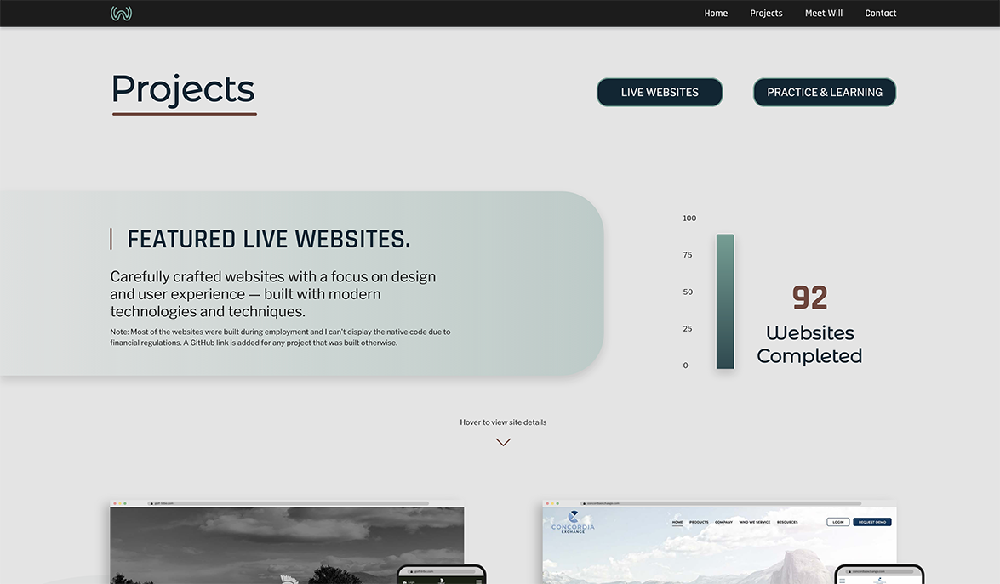
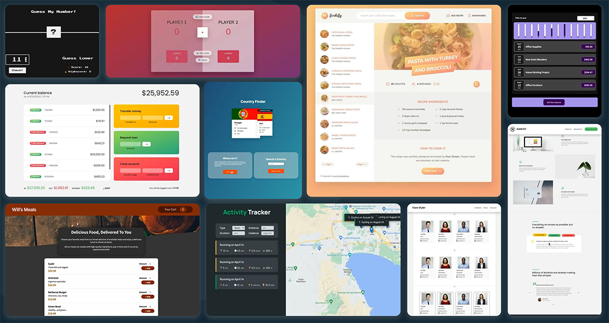
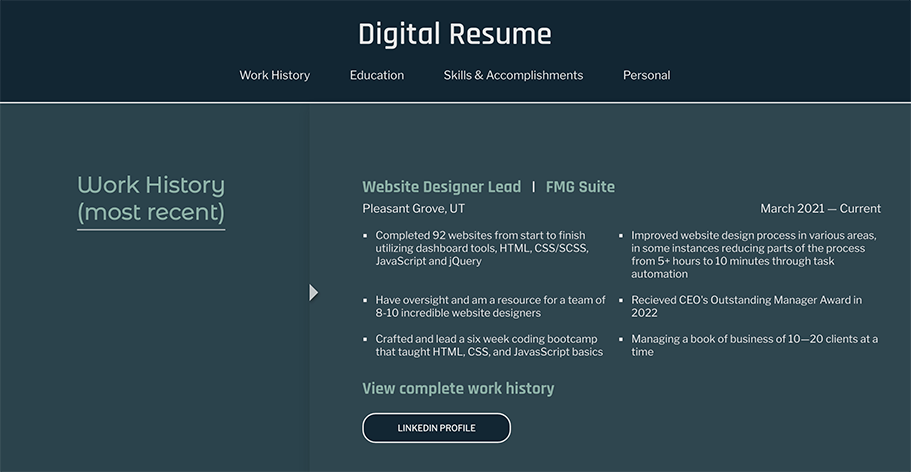

# Will's Websites
## Hello! Welcome to Will's Websites. 

There are three main subpages on the website: Projects, Meet Will, and Contact

***
## Projects

Carefully crafted websites with a focus on design and user experience — built with modern technologies and techniques.

### View live websites and practice/training projects
#### Live Websites

In the live website section you can view 8 featured live websites. Every item in desktop and mobile previews of the projects is built out in code rather than an image — besides the background images that is. You can even see on mobile the short url's on the preview url bar can be copy/pasted. The projects items themsevles are created in React in order to keep the html document lean and keep down on repetitive code.

#### Training & Practice Projects

Training projects focused primarily on Vanilla JavaScript and React. The section itself is a video collage created with CSS Grid and has 4 separate layouts for different screen sizes. All of the projects come with more information once you click on the project to open up the modal. Each project has an introduction, instructions, project takeaways, what the focus of the project was, necessary accreditation, a link to the project, and the link to the project repository.

##### At the end of the Project page you can view the link to website repository and choose to fill out the contact form if you desire.

***
## Meet Will

The Meet Will page utilizes an intersection observer to neatly display the main areas of focus in a scrolling digital resume.

There you can view my work history (with a link to LinkedIn), education, skills & accomplishments, and a personal section with information on some of my hobbies

***
## Contact

I'm excited to hear from you!

