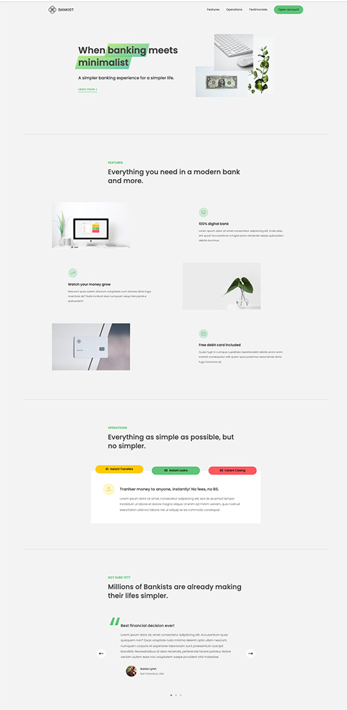

# Bankist
## A mock banking website that neatly displays the company's details to help guide clients to open up an account

## Instructions
### Scroll through the website and interact with features such as the Operation section's "tab divider", or the Testimonial section's "rotator". You can also click on any of the buttons that mention opening an account to mock sign up for an account (doesn't create a real account).
## Project Takeaways:
### How to implement Lazy Loading images for increased speed and performance. Creating a tab divider content to display different pieces of content based on user selection. Creating a rotator to rotate through different slides of content.
## Focus:
### 
## Credit:
### Project idea credit to Jonas Schmedtmann of [Coding Heroes](https://codingheroes.io/)

***
[Open Bankist](https://www.willswebsitesdesign.com/projects/bankist.html)