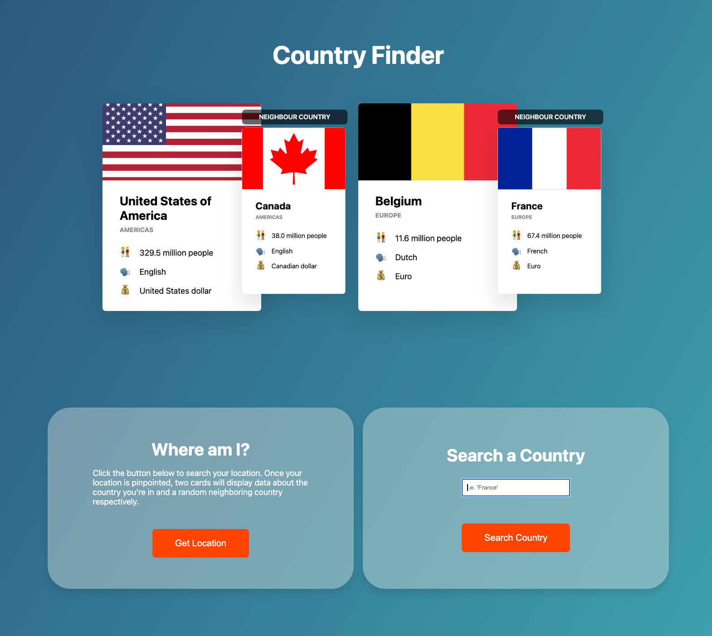

# Country Finder
## View data on the country you're in or search a country of your choice
### *Currently under construction

## Instructions
### You have to enable location services for this application to work. A sample country with some data about the country is loaded in view to start. To search for that same information about the current country you're in, utilize the "Where am I?" box. To search for data on a specific country of your choice, utilize the "Search a Country" box.
## Project Takeaways:
### How to deal with AJAX calls to an external API and handle both resolved and rejected promises. Also focused on handling user input to search for external data and ultimately have that data displayed to the DOM.
## Focus:
### 
## Credit:
### Project idea credit to Jonas Schmedtmann of [Coding Heroes](https://codingheroes.io/)