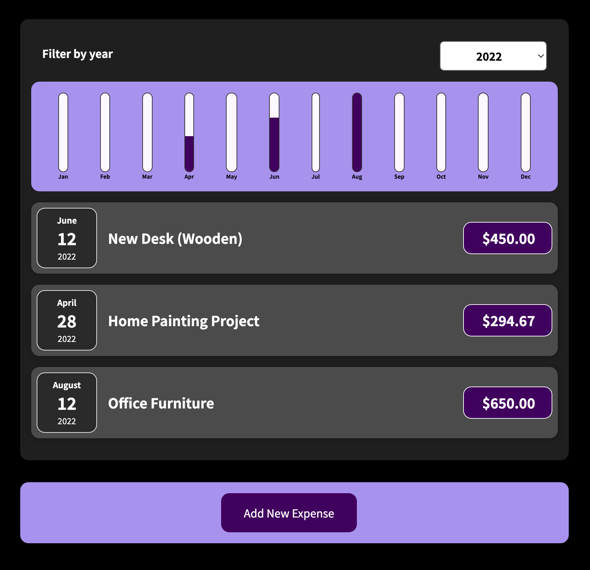

# Expense Tracker
## An application to keep track of outgoing expenses and sort them by year

## Instructions
### There are already a few sample expense items so you can see how it functions. Add as many other expenses as you'd like into the tracker and then sort them by year to keep things organized.
## Project Takeaways:
### Focused on structuring the component filing system to keep things organized while still being accessible. Passed data through multiple components using props and rendered changes to the DOM.
## Focus:
### 
## Credit: 
### Project idea credit to Maximilian Schwarzmüller of [Academind](https://academind.com/)

***
[Open Expense Tracker](https://www.willswebsitesdesign/projects/expense-tracker.html)