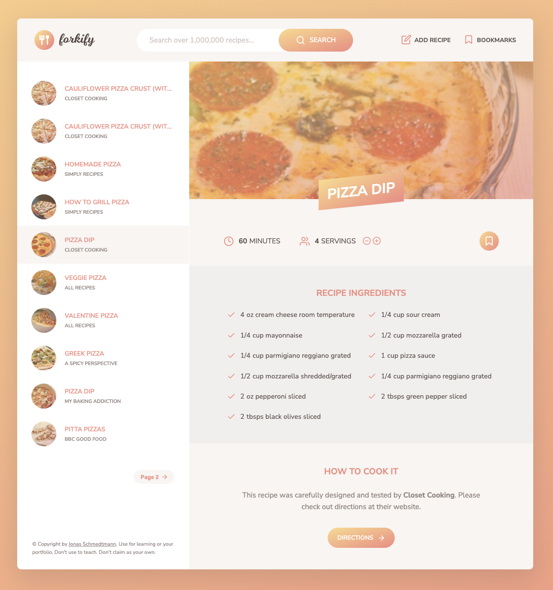

# Forkify
## A convenient recipe finder that you can use to discover and save tasty new recipes.

## Instructions
### Search recipes by typing a type of food into the search bar. Click through the options to view the recipes. You can also increase the servings and even bookmark your favorite recipes. If you have some recipes of your own, you can also add them and they will be automatically added as a bookmark.
## Project Takeaways:
### How to write a more complex application using an MVC, object-oriented architecture. Handled resolved and rejected promises from POST and GET requests to a recipe API. Further learned how to use external libraries such as Fracty.
## Focus:
### 
## Credit:
### Project idea credit to Jonas Schmedtmann of [Coding Heroes](https://codingheroes.io/)

***
[Open Forkify](https://www.willswebsitesdesign.com/projects/forkify.html)