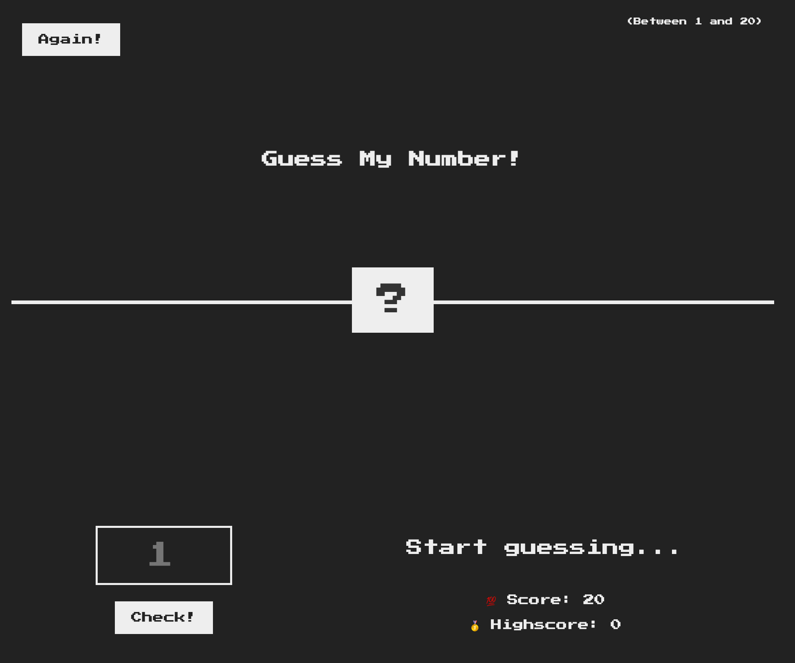

# Number Guesser
## A simple single player game where you attempt to guess a random number in the fewest attempts possible.

## Instructions
### Guess a number between 1-20. You will then find out if your guess is too high or too low from the wording on the right. Each time you guess incorrectly your score will decrease. Once you guess the correct number your score will be kept and you can try again to beat it. Maybe if you're lucky you can get it first try?
## Project Takeaways:
### How to implement logic based on user feedback and adjust the DOM accordingly.
## Focus:
### 
## Credit:
### Project idea credit to Jonas Schmedtmann of [Coding Heroes](https://codingheroes.io/)

***
[Open Number Guesser](https://www.willswebsitesdesign.com/projects/number-guesser.html)