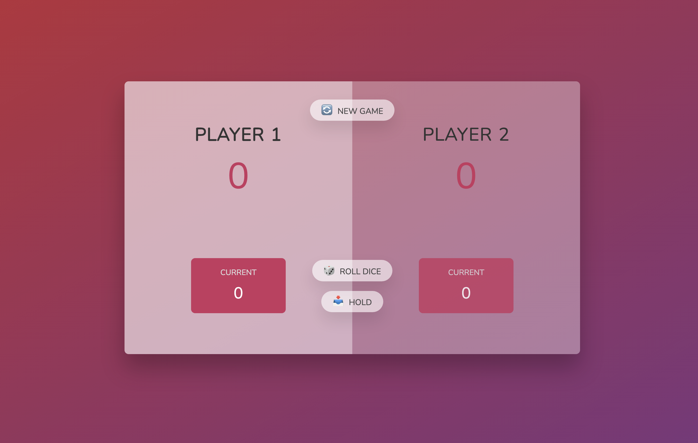

# One-N'-Done
## A 2-player game to see who can get to 100 points first. But be careful, if you roll a 1 then any points you haven't held will be lost!

## Instructions
### The goal is to be the first player to 100 points. You accumulate points by rolling the dice and then 'holding' those points. However if you roll a '1', then whatever points you haven't held will be lost and it will switch to the other player's turn. Don't get too greedy!
## Project Takeaways:
### How to manipulate things in the DOM based on random numbers. Tied in user input based on different portions of logic and provided feedback to the user.
## Focus:
### 
## Credit:
### Project idea credit to Jonas Schmedtmann of [Coding Heroes](https://codingheroes.io/)

***
[Open One-N'-Done](../one-n-done.html)