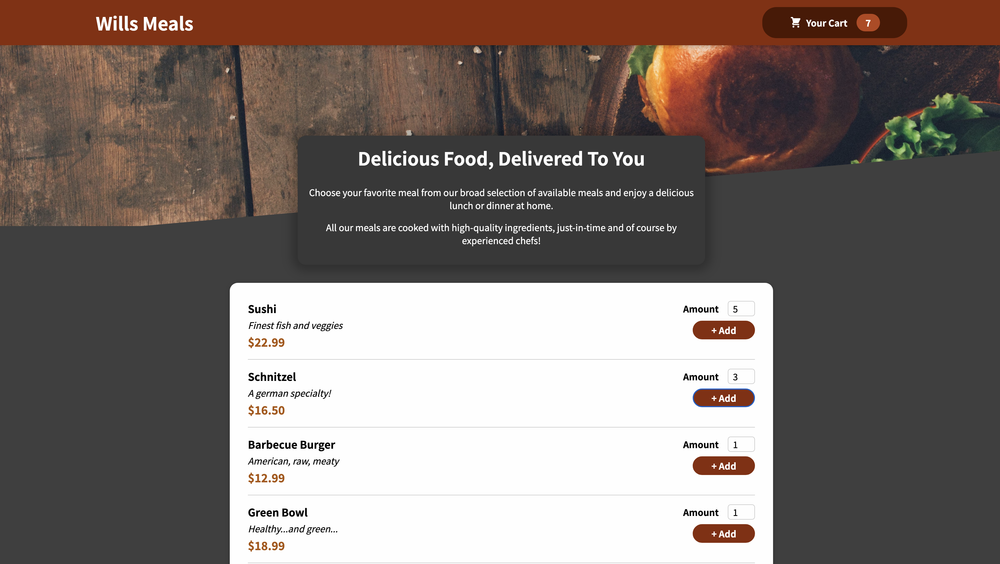

# Wills Meals
## A food ordering application that allows you to add items to your cart and adjust things in the cart.

## Instructions
### Add items to your cart in whatever quanitites you'd like. Then you can access the cart and update any items if needed and all the totals will be calculated for you. Nothing happens when you checkout for now but more features to be added soon!
## Project Takeaways:
### How to configure an app wide context for managing state. Creating items based on user input and needing to handle the side effects that happen as a result of working with form and user input.
## Focus:
### 
## Credit:
### Project idea credit to Maximilian Schwarzmüller of [Academind](https://academind.com/)

***
[Open Will's Meals](../wills-meals.html)