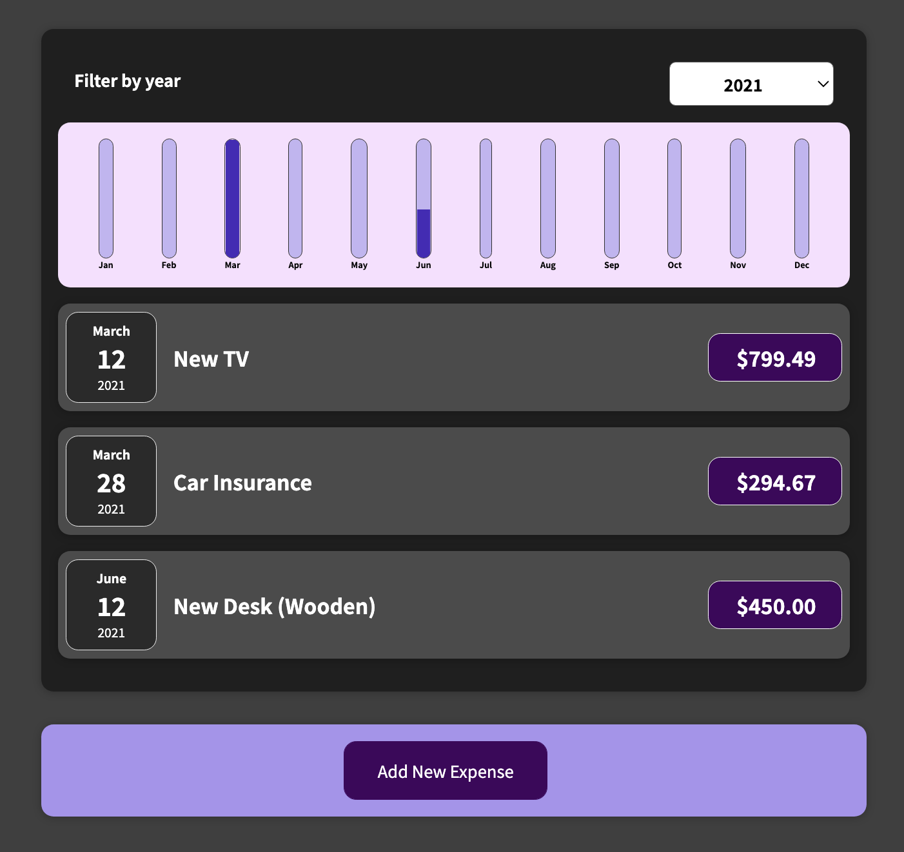

# Team Styler
## A way to neatly display your team members and will eventually include various features to add more members and sections, and have a lot more adjustable settings.
### *Currently under construction

## Instructions
### As the project is under construction, for now you can click on the settings cog wheel on the upper right of any team section and then choose a team style to apply to the team members. You can also click on the add section button (+) to select a new section, although it will not add it to the section list for now. Many more features to come! 
## Project Takeaways:
### How to build a React application from scratch and structure/organize it in a convenient and reusable way. Also added a model to adjust settings and apply css based on user input. Implemented various hooks and modern React features.
## Focus:
### 