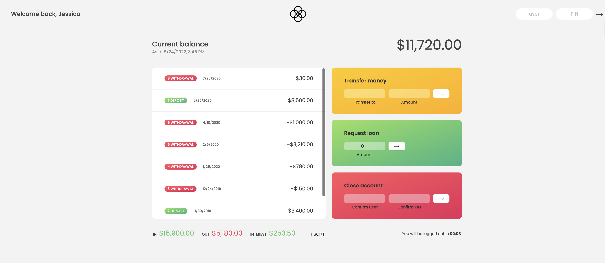

# Thread Bank
## An online banking application where you can mock transfer money to other accounts, request loans, and even close your account if you want (not actual transactions).

## Instructions
### Get started by logging in using demo login credentials. Once inside you can request a loan which can take a few seconds to process, or you can transfer money by inputting another demo users information, or close your account by confirming your demo credentials. You can also sort the transactions in the list, and keep in mind it will log you out of your account after 10 minutes for security reasons!
## Project Takeaways:
### How to write a more complex application with different areas of logic. Working with mock authentication, timers, sorting, and internationalization of formatting dates, currencies, and time.
## Focus:
### 